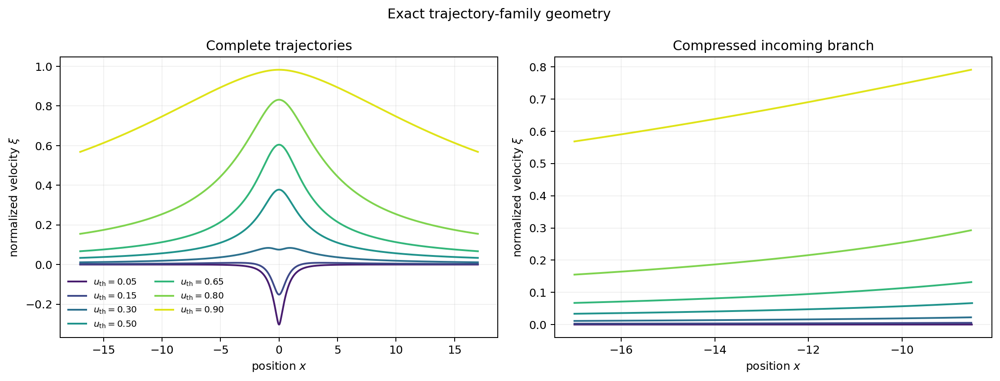
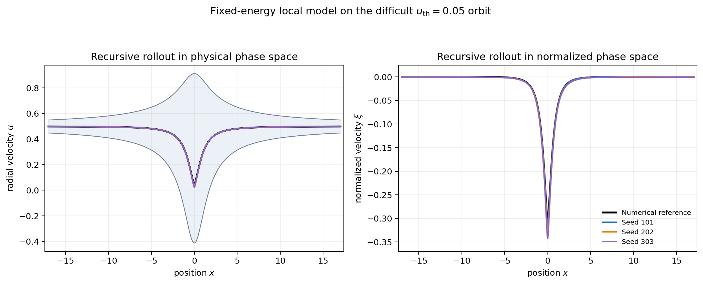
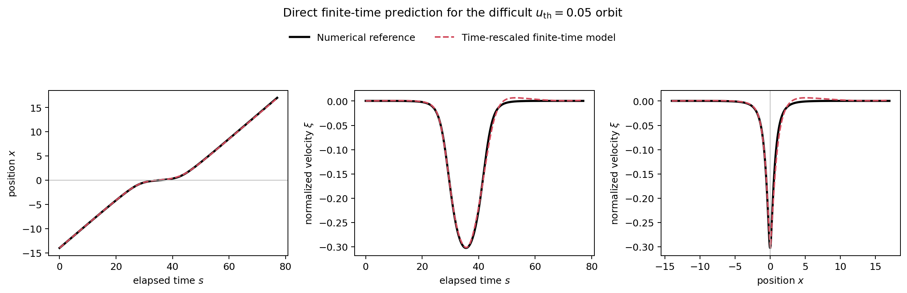
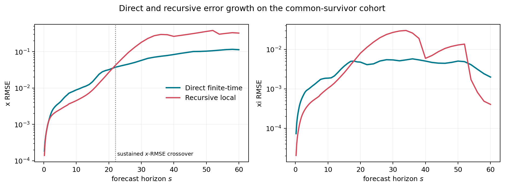

# Learning particle dynamics in a Generalised Ellis–Bronnikov wormhole

This repository is the public code and reproducibility companion to a
scientific study of a particle constrained to a rotating Archimedean spiral in
a Generalised Ellis–Bronnikov wormhole. It keeps the scientific evidence
compact: equations, dataset generators, selected training and evaluation
workflows, tests, aggregate results, and a small set of trajectory-centered
figures. Large generated arrays and intermediate experiment archives are not
part of the release.

> **Full scientific report:** [Open PDF](reports/SCIENTIFIC_ML_WORMHOLE_REPORT.pdf) · [Download PDF](https://raw.githubusercontent.com/NikoGiorgadze/wormhole-sciml/main/reports/SCIENTIFIC_ML_WORMHOLE_REPORT.pdf)

The PDF is the authoritative source for the study design, numerical results,
qualifications, and scientific interpretation.

The physical system is a useful controlled learning problem. Its motion is
low-dimensional and accurately integrable, but the admissible radial-velocity
interval changes with position and dynamically distinct orbit families become
compressed on the incoming branch. We therefore use

$$
\xi=\frac{u-c(x)}{d(x)},\qquad -1<\xi<1,
$$

where $c(x)$ and $d(x)$ are the midpoint and half-width of the local
timelike velocity corridor.



*Exact orbit families in the physically normalized $(x,\xi)$ phase space.
Their incoming compression makes the difficult low-$u_{\rm th}$ families a
sensitive test of learned dynamics.*

## Scientific progression

The study first learns a local residual map and recursively composes it. A
capacity study (including A64 and C32x32 models) improves the local map without
eliminating recursive brittleness. Signed spatial error and exact-state
restart diagnostics show why: small, organized local errors accumulate
coherently when predictions become later inputs.

Adding the exact conserved orbit energy $E_0$ gives the strongest retained
local model,

$$
(x,\xi,E_0)\longmapsto(\Delta x,\Delta\xi).
$$

It changes the mean one-step $\Delta\xi$ RMSE only from
$3.37\times10^{-5}$ to $3.20\times10^{-5}$, but reduces the mean absolute
recursive $\xi$ error on nine difficult incoming rollouts from
$2.70\times10^{-2}$ to $1.48\times10^{-3}$, while changing full-rollout
physical exits from 1/21 to 0/21.



*Exact and recursively predicted trajectories for the difficult
$u_{\rm th}=0.05$ orbit. All three independently trained fixed-energy models
remain inside the timelike region and complete the traversal; the normalized
phase-space view makes their remaining near-throat spread visible.*

The later energy-normal and sensitivity-aware losses improved their intended
local diagnostics but did not improve this decisive recursive result.

The selected alternative predicts finite-time evolution directly from an
exact anchor. It learns an average rate for $x$ and a saturating,
time-rescaled target for $\xi$:

$$
\widehat{\Delta x}=s\widehat V_x,
\qquad
\widehat{\Delta\xi}=5\left(1-e^{-s/5}\right)\widehat F_\xi.
$$

Both gates vanish at $s=0$, so the identity map is exact by construction.



*The selected seed-202 time-rescaled model evaluated directly from an exact
incoming anchor. Position, normalized velocity, and phase-space geometry are
shown for the difficult $u_{\rm th}=0.05$ reference orbit.*

On the 98,304-row validation set, the selected direct model has RMSE 0.0667 in
$x$ and 0.00308 in $\xi$; dense validation finds no predicted
admissibility violations. Its held-out 1,024-orbit test metrics closely match
validation (0.0661 and 0.00310, respectively). The comparison with recursive
local prediction is horizon dependent: direct $x$ RMSE becomes durably
better at $s=22$ on the common-survivor cohort, while the global $\xi$
advantage is not sustained.



*Horizon-dependent RMSE for the selected direct finite-time model and the
strongest retained recursive local model. Only trajectories valid for both
evaluations at each horizon are compared.*

The remaining finite-time error is concentrated in difficult
low-$u_{\rm th}$, long-horizon, and rapid-change regions. A tangent/orbit-normal
decomposition shows that the lowest-family displacement is predominantly
along the exact orbit, with a smaller nonzero normal component. Derivative
loss gives a modest validation improvement but does not remove this structure.
A parameter-count-controlled late split-head model likewise does not improve
the defining difficult-family residual; it is a negative result about that
specific late-branching design, not about output specialization in general.

## Repository map

- `src/wormhole_sciml/` contains the physical equations, numerical integration,
  coordinate transformations, dataset utilities, and model implementations.
- `scripts/` contains the selected physics, generation, training, evaluation,
  diagnostic, and figure-building workflows; its README gives the execution
  order.
- `tests/` provides fast checks independent of the omitted generated archive.
- `results/` contains compact claim-supporting CSV and JSON files with exact
  provenance.
- `docs/` fixes physical conventions, variables, model definitions, historical
  terminology, release scope, and reproduction instructions.
- `reports/` contains the versioned full scientific-report PDF.
- `figures/` contains only the small public visual set.

Internal filenames containing `phase_b`, `phase_c`, `hybrid`, or `microcore`
are retained only where needed to reproduce saved experiment identities. The
public terms are complete orbit banks, finite-time transition dataset,
time-rescaled finite-time model, and targeted difficult-region sampling. See
[`docs/model_definitions.md`](docs/model_definitions.md) for the exact mapping.

## Installation and verification

Python 3.11 or newer is required.

```bash
python -m venv .venv
source .venv/bin/activate
python -m pip install -e '.[test]'
python -m pytest -q
```

The tests check the physical equations and energy relation, admissibility
boundaries, numerical convergence, $u\leftrightarrow\xi$ round trip, local
and finite-time dataset-design contracts, model interfaces and parameter counts, exact zero-time
identity, physical-time differentiation, and the tangent/orbit-normal
decomposition.

Full regeneration begins with [`docs/reproducibility.md`](docs/reproducibility.md).
The large output tree is intentionally ignored; after reproducing the retained
experiments, rebuild the public figures with:

```bash
PYTHONPATH=src python scripts/build_public_figures.py
```

## Results, documentation, and scope

The compact numerical record is indexed in [`results/README.md`](results/README.md).
Physical conventions are in [`docs/physics_notes.md`](docs/physics_notes.md),
and the exact public-release boundary is in
[`docs/repository_scope.md`](docs/repository_scope.md).

The associated physical reference is N. Giorgadze and Z. N. Osmanov,
*Dynamics of a particle in the generalised Ellis–Bronnikov wormhole on the
rotating Archimede's spiral*, **Physica Scripta 99**, 025001 (2024),
[doi:10.1088/1402-4896/ad17ab](https://doi.org/10.1088/1402-4896/ad17ab).

The full scientific report is versioned with this code-and-evidence companion.
Intermediate report drafts and the private experiment archive remain excluded.

## License and citation

The code is available under the [MIT License](LICENSE). Citation metadata is
provided in [`CITATION.cff`](CITATION.cff).
